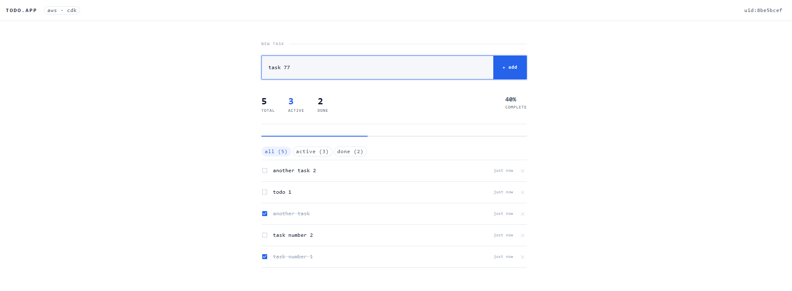

# cdk-todo-infra


Full-stack todo app infrastructure built with AWS CDK. Three repos, three environments (dev / staging / prod), all deployed via `cdk deploy`.



## Repo structure

```
cdk-todo-infra/         ← this repo — CDK stacks
  cdk-todo-infra/
    bin/                ← CDK app entry point
    lib/
      config/           ← per-environment configuration
      stacks/           ← individual CDK stacks
todo-backend/           ← Lambda handler (TypeScript)
todo-frontend/          ← React app (Vite)
```

## Architecture

```
todo-frontend (React/Vite)
      │  /api/* requests
      ▼
CloudFront distribution
  ├── default (*) ──▶  S3 bucket (private, OAC)       React SPA
  └── /api/*      ──▶  API Gateway  ──▶  Lambda  ──▶  DynamoDB
                        (stage prefix stripped by CloudFront originPath)

WAF (WebACL, us-east-1)   — attached to CloudFront; AWSManagedRulesCommonRuleSet + rate limit (1000 req/IP)
ACM Certificate (us-east-1) — DNS-validated via Route53
Route53 (A + AAAA alias)  — points subdomain at CloudFront
```

**API routing via CloudFront:** The React app calls `/api/todos`. CloudFront matches the `/api/*` behavior, strips the `/api` prefix via `originPath: /{stage}`, and forwards the request directly to API Gateway — so no custom domain is needed for the API.

**SPA routing:** CloudFront returns `index.html` for 403/404 responses, enabling client-side routing without a server.

## Stacks

Each environment deploys four stacks:

| Stack                   | Region         | What it creates                                                    |
|-------------------------|----------------|--------------------------------------------------------------------|
| `CertStack-{stage}`     | `us-east-1`    | ACM certificate (DNS-validated, Route53)                           |
| `WafStack-{stage}`      | `us-east-1`    | WAF WebACL (CommonRuleSet + rate limit)                            |
| `ApiStack-{stage}`      | `eu-central-1` | DynamoDB table, Lambda function, API Gateway REST API              |
| `FrontendStack-{stage}` | `eu-central-1` | S3 bucket, CloudFront distribution, Route53 records, S3 deployment |

`CertStack` and `WafStack` are deployed to `us-east-1` because CloudFront requires both ACM certificates and WAF WebACLs to be in that region. Cross-region references (`crossRegionReferences: true`) pass the ARNs to `FrontendStack`.

## CDK concepts covered

| Concept                 | File                    | What it does                                                     |
|-------------------------|-------------------------|------------------------------------------------------------------|
| `crossRegionReferences` | `bin/cdk-todo-infra.ts` | Passes cert/WAF ARNs from us-east-1 to CloudFront stack          |
| `NodejsFunction`        | `api-stack.ts`          | Auto-bundles TypeScript handler with esbuild; minifies in prod   |
| `grantReadWriteData`    | `api-stack.ts`          | IAM grant — replaces manual policy + attachment                  |
| `S3OriginAccessControl` | `frontend-stack.ts`     | Private S3 bucket — only CloudFront can read it                  |
| `additionalBehaviors`   | `frontend-stack.ts`     | Routes `/api/*` to API Gateway, everything else to S3            |
| `OriginRequestPolicy`   | `frontend-stack.ts`     | Forwards `X-User-Id` and `Content-Type` headers to the API       |
| `CachePolicy` (TTL=0)   | `frontend-stack.ts`     | Disables caching for API responses                               |
| `errorResponses`        | `frontend-stack.ts`     | 403/404 → `index.html` for SPA routing                           |
| `Stage`                 | `todo-app-stage.ts`     | Groups all four stacks per environment                           |
| `getConfig(stage)`      | `environments.ts`       | Selects env config from `STAGE` env var; throws on unknown stage |

## Why GitHub Actions instead of CodePipeline

AWS CodePipeline (via CDK Pipelines) was the original deployment mechanism but was replaced by GitHub Actions for the following reasons:

**Cost** — CodePipeline charges per active pipeline per month, plus CodeBuild compute time on every run. For a personal or learning project with infrequent deploys, GitHub Actions free tier (2000 min/month) costs nothing.

**Simplicity** — CDK Pipelines adds a `PipelineStack` that must be bootstrapped and deployed first, and the pipeline then manages itself via a self-mutation step. This is powerful for teams but adds operational overhead (an extra stack to maintain, cross-account trust policies, self-mutation failures to debug) that isn't justified here.

**No CodeStar connection required** — CodePipeline requires a manually created CodeStar connection in the AWS Console to pull from GitHub. GitHub Actions needs only an IAM role with OIDC trust — fully automatable and version-controlled.

**OIDC authentication** — the workflows use `aws-actions/configure-aws-credentials` with `role-to-assume`, so no long-lived AWS credentials are stored anywhere. CodePipeline would handle this internally, but GitHub Actions OIDC is equally secure and more transparent.

**Manual trigger by design** — deploys are triggered via `workflow_dispatch` (manual choice of `dev` or `staging` from the GitHub UI). This suits a project where you want explicit control over when each environment is updated, without a push to `main` automatically rolling out to all stages. A `destroy.yml` workflow handles teardown in the same way.

**Trade-off** — CodePipeline with CDK Pipelines does offer a genuine advantage: the pipeline can update its own CDK definition before deploying the app (self-mutation), which prevents drift between the pipeline definition and the stacks it deploys. With GitHub Actions, the workflow file is the source of truth and is applied immediately on the next run — which is a simpler mental model at the cost of that automatic self-update guarantee.

## One-time setup

### 1. Bootstrap CDK (both regions)

```bash
npx cdk bootstrap aws://YOUR_AWS_ACCOUNT/eu-central-1
npx cdk bootstrap aws://YOUR_AWS_ACCOUNT/us-east-1
```

Both regions must be bootstrapped because stacks are deployed to each.

### 2. Set environment variables

```bash
export CDK_ACCOUNT=123456789012
export DOMAIN_NAME=yourdomain.com
export STAGE=dev   # dev | staging | prod
```

`STAGE` selects the config from `environments.ts` and is appended to all resource names and stack names.

### 3. Build the frontend

```bash
cd todo-frontend
npm ci
VITE_API_URL=https://{stage}.yourdomain.com npm run build
```

The built `dist/` folder is uploaded to S3 by `FrontendStack` on deploy.

### 4. Deploy

```bash
cd cdk-todo-infra
npm ci
npx cdk deploy --all
```

Stacks are deployed in dependency order: `CertStack` and `WafStack` first (us-east-1), then `ApiStack` and `FrontendStack` (eu-central-1).

## Local development

### Backend

```bash
cd todo-backend
npm ci
# Test the handler directly with a mock event, or use AWS SAM local
```

### Frontend

```bash
cd todo-frontend
npm ci
VITE_API_URL=https://dev.yourdomain.com npm run dev
```

## Environments

| Stage   | Subdomain                | Region       | Removal policy |
|---------|--------------------------|--------------|----------------|
| dev     | `dev.yourdomain.com`     | eu-central-1 | DESTROY        |
| staging | `staging.yourdomain.com` | eu-central-1 | DESTROY        |
| prod    | `yourdomain.com`         | eu-central-1 | RETAIN         |

`DESTROY` means all resources (S3 bucket, DynamoDB table, log groups) are deleted on `cdk destroy`. `RETAIN` keeps them.

## Data model

DynamoDB single table: `todos-{stage}`

```
PK: userId   (UUID from browser localStorage — identifies the device)
SK: todoId   (UUID generated at creation)

Attributes:
  title      string
  completed  boolean
  createdAt  ISO string
  updatedAt  ISO string (set on PATCH)
```

Billing mode: `PAY_PER_REQUEST`. No GSIs — the only query pattern is `PK = userId`, which returns all todos for that browser sorted by `todoId`.

## API

Base path: `/api` (routed by CloudFront — no direct API Gateway URL needed).

All requests require the `X-User-Id` header (set automatically by the React app from `localStorage`).

| Method | Path                | Body                     | Description                  |
|--------|---------------------|--------------------------|------------------------------|
| GET    | /api/todos          | —                        | List all todos for this user |
| POST   | /api/todos          | `{ title: string }`      | Create a new todo            |
| PATCH  | /api/todos/{todoId} | `{ completed: boolean }` | Toggle completed state       |
| DELETE | /api/todos/{todoId} | —                        | Delete a todo                |

CORS is open (`allowOrigins: ALL_ORIGINS`) with `X-User-Id` and `Content-Type` in allowed headers.

Lambda logs are retained for 1 week (dev/staging) or 1 month (prod).